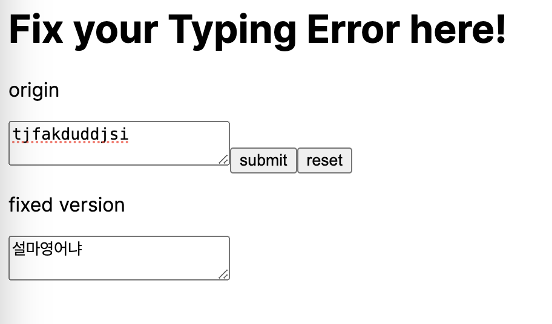
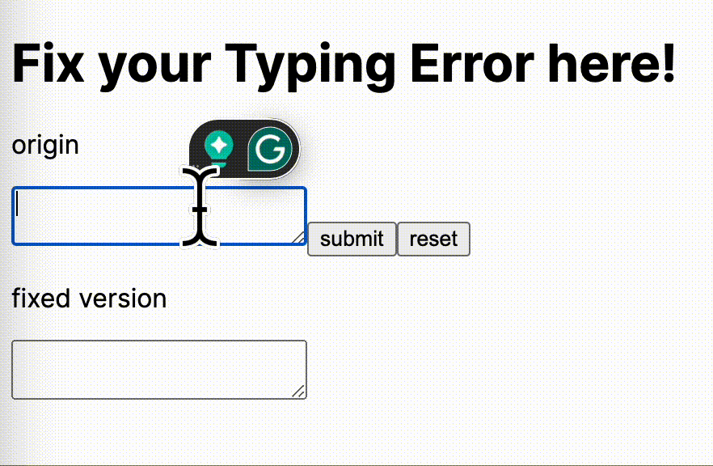

## Fix Your Typing Mistake: English to Korean

<a href="https://velog.io/@roum02/%EC%98%81%ED%83%80-%ED%95%9C%EA%B5%AD%EC%96%B4-%EB%B3%80%ED%99%98%EA%B8%B0-%EC%A0%9C%EC%9E%91%EA%B8%B01">you could see my blog here.</a>

Have you ever experienced typing in korean using an English keyboard layout?
What if you do not recognize this mistakes until you have finished typing? 

This tool would be really helpful for you in such cases!



[//]: # (### How to use it?)


### How to make it?

This algorithm easily divides into three parts:

1. Matching English Characters to Korean Characters.
```javascript
dkssud -> 'ㅇ ㅏ ㄴ ㄴ ㅕ ㅇ'
```
2. Making a syllable of Korean.
```javascript
'ㅇ ㅏ ㄴ ㄴ ㅕ ㅇ' -> ['ㅇ ㅏ ㄴ', 'ㄴ ㅕ ㅇ']
```
3. Changing a syllable to Hangul.
```javascript
['ㅇ ㅏ ㄴ', 'ㄴ ㅕ ㅇ'] -> '안녕'
```

### Describe each part

1. Matching English Characters to Korean Characters.

Think of performance in JavaScript, Pick the Map data format for matching each character.

```javascript
export const KOREAN_DICTIONARY = new Map([
    ['q','ㅂ'], ['Q', 'ㅃ'], ['w', 'ㅈ'], ['W','ㅉ'],
    ['e','ㄷ'], ['E','ㄸ'], ['r','ㄱ'], ['R','ㄲ'], ['t','ㅅ'],
    ['T','ㅆ'], ['y','ㅛ'], ['u','ㅕ'], ['i','ㅑ'], ['o','ㅐ'],
    ['p','ㅔ'], ['a','ㅁ'], ['s','ㄴ'], ['d','ㅇ'], ['f','ㄹ'],
    ['g','ㅎ'], ['h','ㅗ'], ['j','ㅓ'], ['k','ㅏ'], ['l','ㅣ'],
    ['z','ㅋ'], ['x','ㅌ'], ['c','ㅊ'], ['v','ㅍ'], ['b','ㅠ'],
    ['n','ㅜ'], ['m','ㅡ'], ['O','ㅒ'], ['P','ㅖ'], ['Y','ㅛ'],
    ['U','ㅕ'], ['I','ㅑ'], ['H','ㅗ'], ['J','ㅓ'], ['K','ㅏ'],
    ['L','ㅣ'], ['B','ㅠ'], ['N','ㅜ'], ['M','ㅡ'], ['A','ㅁ'],
    ['S','ㄴ'], ['D','ㅇ'], ['F','ㄹ'], ['G','ㅎ'], ['Z','ㅋ'],
    ['X','ㅌ'], ['C','ㅊ'], ['V','ㅍ']
])

/** get a korean character matched an english character*/
export const handleEnglishCharacterMatch = (englishText: string) => {
    let koreanTextArray: string[] = [];
    for(const char of englishText){
        const matchedKoreanChar = KOREAN_DICTIONARY.get(char);
        if(matchedKoreanChar){
            koreanTextArray.push(matchedKoreanChar);
        } else {
            koreanTextArray.push(char)
        }
    }

    return koreanTextArray;
}

```


2. Making a syllable of Korean.

It is a main part to make a perfect syllable in Korean.

```javascript
  const isJungseong = (char: string) => JUNGSEONG.has(char);
    const isChoseong = (char: string) => CHOSEONG.has(char);
    const isJongseong = (char: string) => JONGSEONG.has(char);

    /** Check if the current character is the end of a word */
    const isEndOfWord = (currentChar: string, nextChar: string | undefined, prevChar: string | undefined): boolean => {

        // 중성 + 초성
        if (isJungseong(currentChar) && nextChar && isChoseong(nextChar)) {
            return true;
        }
        // 종성 + 초성
        if (isJongseong(currentChar) && nextChar && isChoseong(nextChar)) {
            return true;
        }
        // 초성 + 초성 or 초성 + undefined
        if (isChoseong(currentChar) && (!nextChar || isChoseong(nextChar))) {
            return true;
        }
        // 초성 + 중성 + 종성
        if (prevChar && isChoseong(prevChar) && isJungseong(currentChar) && nextChar && (isChoseong(nextChar) || isJongseong(nextChar))) {
            return true;
        }
        return false;
    };

 /** split korean characters into syllables */
    koreanCharacterArray.reduce((acc: string[], char, i, array) => {
        const nextChar = array[i + 1];
        const prevChar = array[i - 1];

        // 현재 문자와 다음 문자를 기준으로 음절 경계를 판단하여 음절을 분리
        if (i === array.length - 1 || isEndOfWord(char, nextChar, prevChar)) {
            acc.push(array.slice(start, i + 1).join(''));
            start = i + 1;
        }

        // 자음 하나로 묶기: 단일 자음이 있는 경우 이전 음절과 합침
        const lastWord = acc[acc.length - 1];
        if (lastWord && lastWord.length === 1 && isChoseong(lastWord) && acc.length > 1) {
            const mergedWord = acc[acc.length - 2] + lastWord;
            acc.splice(acc.length - 2, 2, mergedWord);
        }

        return acc;
    }, words);
```

especially in Korea, we have double consonants and double vowels.
So it is necessary to handle them separately.

```javascript
    /** convert dubble letter */
    const processWord = (word: string): string => {
        const wordArray = word.split('');

        const processDoubleLetter = (arr: string[], startIndex: number, isDoubleFunc: (char: string) => boolean, makeListFunc: (subArr: string[]) => string): void => {
            if (isDoubleFunc(arr[startIndex]) && isDoubleFunc(arr[startIndex + 1])) {
                const original = arr[startIndex];
                arr[startIndex] = makeListFunc(arr.slice(startIndex, startIndex + 2));
                if (original !== arr[startIndex]) {
                    arr.splice(startIndex + 1, 1);
                }
            }
        };

        if (wordArray.length > 2 && isChoseong(wordArray[0]) && isJungseong(wordArray[1])) {
            processDoubleLetter(wordArray, 1,isJungseong, makeJungseongList);
        }

        if (wordArray.length >= 4 && isJongseong(wordArray[2]) && isJongseong(wordArray[3])) {
            processDoubleLetter(wordArray, 2, isJongseong, makeJongseongList);
        }

        return wordArray.join('');
    };

```

3. Changing a syllable to Hangul.

It is simple, just use the unicode logic.

```javascript
/** change split character to korean  */
const combineKoreanCharacter = (characterArray: string[]): string => {
    const [choseong, jungseong, jongseong] = characterArray;

    const choseongIndex = CHOSEONG.get(choseong) as number;
    const jungseongIndex = JUNGSEONG.get(jungseong) as number;
    const jongseongIndex = JONGSEONG.get(jongseong) || 0;

    const hangulChar =  String.fromCharCode(0xAC00 + (choseongIndex * 21 * 28) + (jungseongIndex * 28) + jongseongIndex)
    return hangulChar;
}
```


### done!

 
