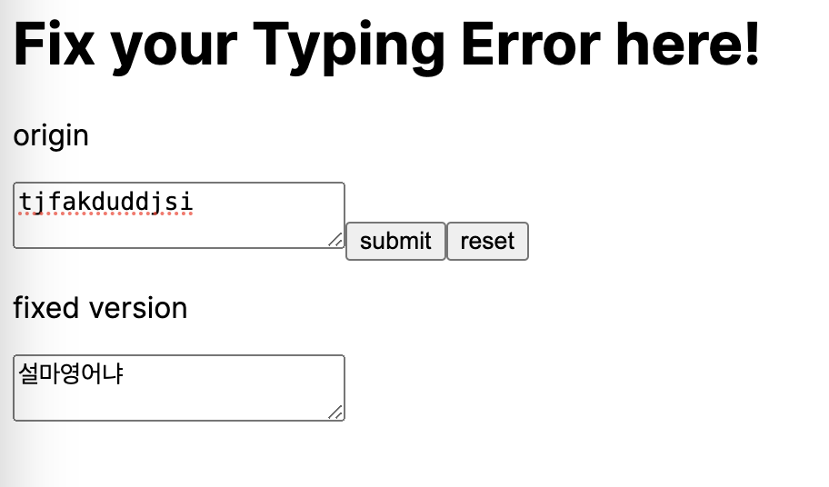

### Fix Your Typing Mistake: English to Korean

Have you ever experienced typing in korean using an English keyboard layout?
What if you do not recognize this mistakes until you have finished typing? 

This tool would be really helpful for you in such cases!



[//]: # (### How to use it?)


### How to make it?

This algorithm easily divides into three parts:

1. Matching English Characters to Korean Characters.
```javascript
dkssud -> 'ㅇ ㅏ ㄴ ㄴ ㅕ ㅇ'
```
2. Making a syllable of Korean.
```javascript
'ㅇ ㅏ ㄴ ㄴ ㅕ ㅇ' -> ['ㅇ ㅏ ㄴ', 'ㄴ ㅕ ㅇ']
```
3. Changing a syllable to Hangul.
```javascript
['ㅇ ㅏ ㄴ', 'ㄴ ㅕ ㅇ'] -> '안녕'
```


